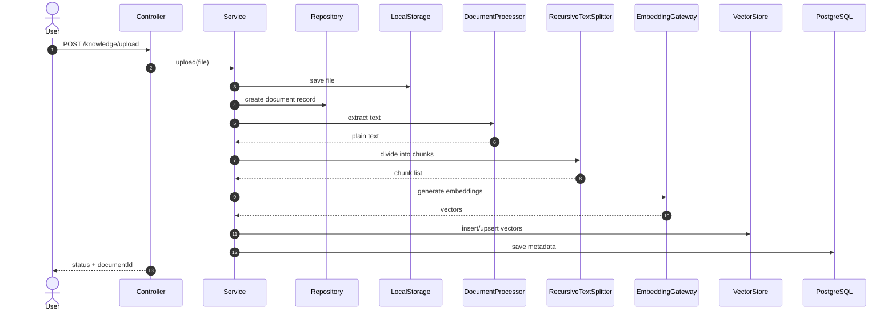

# Knowledge Module — Technical Document

## 1. Mục tiêu kỹ thuật

Knowledge Module triển khai một pipeline RAG hoàn chỉnh ở tầng backend. Nó kết hợp nhiều thành phần:

- upload và validate file,
- lưu file gốc,
- trích xuất text,
- chia chunk,
- tạo embedding,
- lưu vector vào vector store,
- truy xuất theo ngữ nghĩa,
- cung cấp context cho Chat/Agent.

## 2. Cấu trúc module

```text
apps/api/src/modules/knowledge
├── knowledge.controller.ts
├── knowledge.service.ts
├── knowledge.repository.ts
├── knowledge.module.ts
├── knowledge.ingestion.worker.ts
├── dto/
├── entities/
├── services/
└── docs/
```

## 3. Thành phần chính

### 3.1 KnowledgeController
Controller định nghĩa các endpoint chính:

- `POST /knowledge/upload`
- `GET /knowledge/search`
- `GET /knowledge/context`
- `POST /knowledge/messages/:messageId/documents`
- `GET /knowledge/:id/chunks`
- `POST /knowledge/:id/reindex`

### 3.2 KnowledgeService
Service là nơi thực hiện pipeline chính. Nó quản lý:

1. validate file,
2. lưu file vào LocalStorage,
3. tạo `Document` record,
4. chạy extraction,
5. `RecursiveTextSplitter` cắt chunk,
6. `EmbeddingGatewayService` sinh embedding,
7. `VectorStoreFactory` lưu index,
8. update status và metadata.

### 3.3 KnowledgeRepository
Repository là lớp truy cập dữ liệu thực. Nó làm việc với Prisma và quản lý các bảng:

- `documents`
- `document_chunks`
- `message_documents`

### 3.4 RecursiveTextSplitter
Lớp này tách văn bản đệ quy theo separator ưu tiên để giảm nguy cơ cắt giữa câu từ:

- xuống dòng,
- câu,
- dấu chấm,
- dấu phẩy,
- khoảng trắng,
- ký tự đơn.

Điều này giúp chunk có tính ngữ nghĩa tốt hơn và dễ retrieval hơn.

### 3.5 KnowledgeIngestionWorker
Khi chế độ `queue` được bật, worker BullMQ sẽ xử lý ingestion ở background. Nó giúp không làm chậm request upload và đảm bảo xử lý tài liệu bất đồng bộ.

## 4. Cơ sở dữ liệu

### Document
Lưu metadata tài liệu gốc:

- `id`
- `title`
- `fileType`
- `sourceUrl`
- `status`
- `createdAt`

### DocumentChunk
Mỗi chunk lưu:

- `id`
- `documentId`
- `content`
- `metadata`
- `embedding`

### MessageDocument
Bảng trung gian để liên kết message với document:

```text
messageId + documentId
```

Điều này cho phép hệ thống truy nguyên source document cho từng message cụ thể.

## 5. Pipeline kỹ thuật chi tiết

### Bước 1: Upload
Controller nhận file multipart và gọi `KnowledgeService.upload`.

### Bước 2: Validate file
Hệ thống kiểm tra:

- file có tồn tại không,
- extension / mime type hợp lệ,
- dung lượng không vượt quá ngưỡng cho phép,
- nội dung không rỗng.

### Bước 3: Lưu file gốc
`LocalStorageService` lưu bản gốc xuống storage để có thể reindex sau này.

### Bước 4: Trích xuất text
`DocumentProcessorService` đọc PDF/DOCX/TXT/Markdown và lấy text thuần.

### Bước 5: Chunking
`RecursiveTextSplitter` chia text thành các chunk có độ dài rõ ràng và chồng lấn `overlap` để bảo toàn ngữ cảnh.

### Bước 6: Embedding
Mỗi chunk được vector hóa. Kỹ thuật này cho phép tìm kiếm “ngữ nghĩa”, không chỉ khớp từ khóa.

### Bước 7: Index vào vector store
Vector được lưu lên vector store để tìm kiếm similarity nhanh hơn.

### Bước 8: Retrieval
Khi có query, hệ thống vector hóa câu hỏi rồi tìm top K chunk có độ tương đồng cao nhất.

## 6. Request flow kỹ thuật



## 7. Đặc điểm kỹ thuật quan trọng

### Idempotency
Các thao tác như tạo document hoặc gắn tài liệu vào message đều được thiết kế để tránh duplicate khi retry.

### Separation of concerns
- Controller: API layer
- Service: business orchestration
- Repository: data access
- Storage / DocumentProcessor: external adapters
- Queue worker: async background execution

### Observability
Nên monitor các yếu tố:

- số lượng document được upload,
- số chunk tạo ra,
- lỗi indexing,
- thời gian retrieval,
- trạng thái `pending` / `processing` / `indexed` / `failed`.

## 8. Mở rộng trong tương lai

Knowledge Module hiện đã có nền tảng RAG mạnh, có thể mở rộng thêm:

- OCR cho PDF scan,
- hybrid search (keyword + vector),
- tri thức theo user/team,
- citation nguồn gốc rõ ràng,
- multi-language embedding,
- quyền truy cập tài liệu theo vai trò.

## 9. Kết luận

Knowledge Module trong AIOS là một hệ thống kỹ thuật hiện đại, triển khai đúng chuẩn RAG: nhập tài liệu → tách chunk → sinh embedding → vector search → đưa context vào prompt. Đây là nền tảng then chốt để AIOS có thể “nhớ” và “tra cứu” tri thức dựa trên dữ liệu thật, không chỉ phản hồi theo mẫu ngôn ngữ tổng quát.
