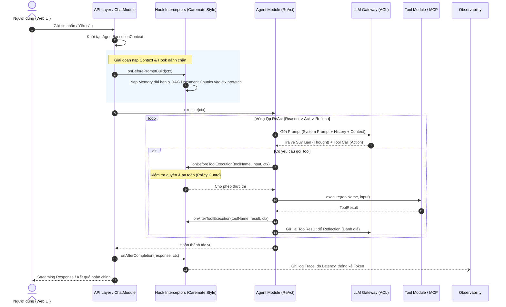

# AIOS Architecture Specification

> **Tài liệu đặc tả kiến trúc tổng thể hệ thống AIOS (Personal AI Operating System)**  
> *Được thiết kế theo phong cách Modular Monolith & Clean Architecture, kế thừa các nguyên lý trừu tượng hóa cốt lõi, Context Pattern và Lifecycle Hooks từ hệ thống Caremate.*

---

## 1. Tầm nhìn & Triết lý Thiết kế (Design Philosophy)

### 1.1. Tầm nhìn
AIOS không phải là một chatbot thông thường, mà là một **Personal Chief of Staff** (Trợ lý điều hành cá nhân). Hệ thống đóng vai trò hạt nhân điều phối tập trung giữa:
* **Mô hình ngôn ngữ lớn (LLM):** Suy luận, lập kế hoạch, tổng hợp.
* **Hệ thống tri thức cá nhân:** Lịch làm việc (Calendar), GitHub Issues, Email, Kho tài liệu (RAG), Ghi chú, Kế hoạch (Todo/Plan).
* **Công cụ thực thi (Tools/MCP):** Tác động và tương tác với thế giới bên ngoài.

### 1.2. Triết lý Kiến trúc
Hệ thống kết hợp 2 trường phái:
1. **Sự tự chủ & linh hoạt của AI Agent (ReAct Loop, Multi-Agent):** Cho phép AI giải quyết các bài toán mở, không bị giới hạn bởi các kịch bản cứng.
2. **Sự chặt chẽ, tường minh và chuẩn mực kế thừa từ Caremate:** Đưa vào các khái niệm trừu tượng hóa chuẩn (Core Contracts, Context Passing, Lifecycle Hooks, Anti-Corruption Layer) giúp hệ thống bền vững, dễ kiểm thử và độc lập với công nghệ bên ngoài.

---

## 2. Những Điểm Sáng Kế Thừa Từ Caremate

Qua quá trình phân tích kiến trúc của Caremate, AIOS kế thừa và áp dụng 4 nguyên tắc kỹ thuật quan trọng:

```
┌────────────────────────────────────────────────────────────────────────┐
│                        CAREMATES INSPIRATIONS                          │
├─────────────────────────┬──────────────────────────────────────────────┤
│ Ngắn gọn ở Caremate     │ Ứng dụng cụ thể vào AIOS                      │
├─────────────────────────┼──────────────────────────────────────────────┤
│ 1. Pure Core Contracts  │ Định nghĩa Interface/DTOs thuần khiết tại    │
│    (Chữ ký hàm độc lập) │ tầng Core, không phụ thuộc NestJS hay DB.    │
├─────────────────────────┼──────────────────────────────────────────────┤
│ 2. CdsRequest Context   │ Khái niệm AgentExecutionContext (Immutable   │
│    (Context Passing)    │ Context Object đi xuyên suốt vòng đời Agent) │
├─────────────────────────┼──────────────────────────────────────────────┤
│ 3. CDS Hook LifeCycle   │ AIOS Lifecycle Interceptors (đánh chặn trước │
│    (Hệ thống Event Hook)│ và sau khi gọi LLM/Tool để kiểm soát an toàn)│
├─────────────────────────┼──────────────────────────────────────────────┤
│ 4. Anti-Corruption Layer│ LLM Gateway cô lập hoàn toàn các LLM Provider│
│    (Bảo vệ Core Domain) │ (OpenAI, Anthropic, Gemini, Ollama).         │
└─────────────────────────┴──────────────────────────────────────────────┘
```

### 2.1. Pure Core & Contract-First
* **Vấn đề:** Các dự án AI thông thường hay import trực tiếp SDK (ví dụ: `import OpenAI from 'openai'`) hoặc truy cập thẳng Prisma model trong Controller/Service, dẫn đến việc khi đổi provider hoặc nâng cấp thư viện thì vỡ mã nguồn hàng loạt.
* **Giải pháp thừa hưởng:** Tầng `core/` chỉ chứa **Interface thuần TypeScript** (Pure Types). Logic nghiệp vụ của AIOS chỉ phụ thuộc vào Interface, không phụ thuộc vào việc bên ngoài dùng thư viện nào.

### 2.2. Context Object Pattern (`AgentExecutionContext`)
* **Vấn đề:** Trong luồng xử lý AI, một Agent cần rất nhiều thông tin: `userId`, `conversationId`, `history`, `memoryProfile`, `documentChunks`, `allowedTools`, `traceId`. Nếu truyền lẻ tẻ qua các hàm, chữ ký hàm (function signatures) sẽ phình to và rất khó bảo trì.
* **Giải pháp thừa hưởng:** Đóng gói toàn bộ thành một đối tượng bất biến (`readonly`) tương tự như `CdsRequest` của Caremate:

```typescript
// core/context/agent-context.interface.ts
export interface AgentExecutionContext {
  readonly executionId: string;       // Unique trace ID cho một phiên chạy
  readonly sessionId: string;         // ID phiên hội thoại hoặc agent session
  readonly query: string;             // Yêu cầu gốc của người dùng
  readonly context: {
    readonly userProfile: Record<string, unknown>; // Memory dài hạn
    readonly systemRules: string[];                // Quy tắc hệ thống
    readonly activePlans?: Record<string, unknown>;// Các plan hiện tại
  };
  readonly prefetch?: {
    readonly ragChunks?: DocumentChunk[];          // Dữ liệu RAG nạp trước
    readonly recentMessages?: Message[];           // Lịch sử chat gần nhất
  };
  readonly availableTools: ToolDefinition[];       // Danh sách công cụ được phép dùng
  readonly metadata: Record<string, unknown>;      // Thông tin mở rộng
}
```

### 2.3. AIOS Lifecycle Hooks (Hệ thống Hook đánh chặn)
Tương tự như cơ chế CDS Hooks lắng nghe các sự kiện y tế (`patient-view`, `order-select`), AIOS thiết lập các điểm đánh chặn (Interceptors/Hooks) trong chu trình suy luận của Agent:

```typescript
// core/hooks/aios-hook.interface.ts
export interface AIOSHookHandler {
  /** Được gọi trước khi LLM Gateway build prompt (bổ sung memory, filter RAG) */
  onBeforePromptBuild?(ctx: AgentExecutionContext): Promise<void>;

  /** Được gọi trước khi một Tool được kích hoạt (kiểm tra quyền, an toàn hệ thống) */
  onBeforeToolExecution?(toolName: string, input: Record<string, unknown>, ctx: AgentExecutionContext): Promise<boolean>;

  /** Được gọi sau khi Tool trả về kết quả */
  onAfterToolExecution?(toolName: string, result: unknown, ctx: AgentExecutionContext): Promise<void>;

  /** Được gọi sau khi hoàn tất (ghi log Observability, tính toán token) */
  onAfterCompletion?(response: AgentResponse, ctx: AgentExecutionContext): Promise<void>;
}
```

---

## 3. Kiến Trúc Phân Tầng Tổng Thể (Layered Architecture)

Hệ thống được tổ chức theo 4 tầng phân tách nghiêm ngặt, dòng phụ thuộc chỉ đi từ ngoài vào trong:

```
+-----------------------------------------------------------------------------------+
| 1. PRESENTATION & INTERFACE LAYER                                                 |
|    - React Web App (Vite) | REST API (NestJS) | SSE / WebSocket Streaming | CLI   |
+-----------------------------------------------------------------------------------+
                                         │
                                         ▼
+-----------------------------------------------------------------------------------+
| 2. APPLICATION & BUSINESS MODULES LAYER                                           |
|    ┌─────────────┐ ┌─────────────┐ ┌─────────────┐ ┌─────────────┐ ┌────────────┐ |
|    │ Chat Module │ │ Knowledge   │ │ Memory      │ │ Planner     │ │ Workflow   │ |
|    │ (Orchestr.) │ │ Module(RAG) │ │ Module      │ │ Module      │ │ Engine     │ |
|    └──────┬──────┘ └──────┬──────┘ └──────┬──────┘ └──────┬──────┘ └─────┬──────┘ |
|           │               │               │               │              │        |
|           └───────────────┴───────┬───────┴───────────────┴──────────────┘        |
|                                   ▼                                               |
|                    ┌─────────────────────────────┐                                |
|                    │    Agents Module (ReAct)    │                                |
|                    │  Router | Session | Runner  │                                |
|                    └──────────────┬──────────────┘                                |
+-----------------------------------┼────────────────────────────────---------------+
                                    │
                                    ▼
+-----------------------------------------------------------------------------------+
| 3. CORE DOMAIN & CONTRACTS LAYER (Thừa hưởng từ Caremate)                          |
|    - AgentExecutionContext (Immutable Context Object)                             |
|    - Lifecycle Hook Engine (beforePrompt, beforeTool, afterCompletion)            |
|    - LLM Gateway Interface (Anti-Corruption Layer che giấu LLM Provider)         |
|    - Tool Registry & MCP Protocol Interface                                      |
|    - Observability & Tracing Contracts                                            |
+-----------------------------------------------------------------------------------+
                                    │
                                    ▼
+-----------------------------------------------------------------------------------+
| 4. INFRASTRUCTURE & ADAPTERS LAYER                                                |
|    - Database: PostgreSQL (Prisma ORM)                                            |
|    - Vector Store: Qdrant / pgvector                                              |
|    - Cache & Async Queue: Redis (BullMQ)                                          |
|    - External LLM: OpenAI, Anthropic, Gemini, Local Ollama                        |
|    - External Tools: MCP Servers, GitHub API, Filesystem, Google APIs             |
+-----------------------------------------------------------------------------------+
```

---

## 4. Cấu Trúc Monorepo Chuẩn Thực Tế (`pnpm workspace`)

```
AIOS/
├── apps/
│   ├── api/                                  # Ứng dụng Backend NestJS
│   │   ├── src/
│   │   │   ├── main.ts                       # Khởi tạo Server & WebSockets
│   │   │   ├── app.module.ts                 # Import toàn bộ các module
│   │   │   │
│   │   │   ├── core/                         # CORE CONTRACTS & KERNEL (Pure TS & Interfaces)
│   │   │   │   ├── context/                  # ExecutionContext, ContextBuilder
│   │   │   │   ├── hooks/                    # HookRegistry, HookHandler interfaces
│   │   │   │   ├── llm/                      # LLM Gateway interface & ACL
│   │   │   │   │   ├── interfaces/           # ILLMClient, IPromptBuilder, ITokenCounter
│   │   │   │   │   └── llm-gateway.service.ts
│   │   │   │   └── observability/            # ITracer, IMetricsCollector
│   │   │   │
│   │   │   ├── modules/                      # BUSINESS MODULES
│   │   │   │   ├── chat/                     # Quản lý Chat, Message, Streaming
│   │   │   │   ├── knowledge/                # Chunking, Vector Embedding, RAG
│   │   │   │   ├── memory/                   # Quản lý Long-term Profile/Preferences
│   │   │   │   ├── planner/                  # Quản lý Plan, Task, Roadmap
│   │   │   │   ├── tools/                    # Tool Registry, Built-in Tools, MCP Client
│   │   │   │   ├── workflow/                 # Workflow Engine (DAG, Step Runner)
│   │   │   │   └── agents/                   # ReAct Runner, Specialized Agents
│   │   │   │
│   │   │   └── infrastructure/               # IMPLEMENTATIONS & ADAPTERS
│   │   │       ├── database/                 # PrismaService, Repositories
│   │   │       ├── vector-store/             # QdrantAdapter / PgVectorAdapter
│   │   │       ├── llm-providers/            # OpenAIAdapter, GeminiAdapter, OllamaAdapter
│   │   │       └── queue/                    # BullMQ setup cho Background Workers
│   │   │
│   │   ├── prisma/
│   │   │   └── schema.prisma                 # Lược đồ cơ sở dữ liệu quan hệ
│   │   └── package.json
│   │
│   └── web/                                  # Ứng dụng Frontend React 19 (Vite)
│       ├── src/
│       │   ├── components/                   # ChatBox, MarkdownViewer, KanbanBoard
│       │   ├── views/                        # ChatView, KnowledgeHub, PlanDashboard
│       │   ├── hooks/                        # useChatStream, useAgentRun
│       │   └── stores/                       # Zustand stores
│       └── package.json
│
├── docker/                                   # HẠ TẦNG DỊCH VỤ
│   ├── docker-compose.yml                    # PostgreSQL (pgvector), Redis, Qdrant
│   └── .env.example
│
├── packages/                                 # THƯ VIỆN DÙNG CHUNG
│   └── shared-types/                         # Contracts & DTOs dùng chung cho API & Web
│
├── docs/                                     # TÀI LIỆU HỆ THỐNG
│   ├── architecture.md                       # (Tài liệu này)
│   ├── module-decomposition.md
│   └── vision-and-scope-docs.md
│
├── pnpm-workspace.yaml
└── README.md
```

---

## 5. Chu Trình Thực Thi Của Agent Kết Hợp Context & Hooks

Khi một tác vụ phức tạp được kích hoạt (ví dụ: *"Hôm nay mình cần làm gì?"*):



---

## 6. Chiến Lược Lưu Trữ Dữ Liệu (Data Architecture)

| Loại dữ liệu | Nơi lưu trữ | Cơ chế quản lý |
|---|---|---|
| **Dữ liệu quan hệ & nghiệp vụ** | PostgreSQL | `Conversation`, `Message`, `Plan`, `Task`, `WorkflowState`, `MemoryRecord`. Quản lý qua Prisma ORM. |
| **Dữ liệu Vector (RAG)** | Qdrant hoặc pgvector | Lưu trữ vector embeddings (768 hoặc 1536 chiều) của các đoạn tài liệu (`DocumentChunk`). |
| **Dữ liệu Cache & Tạm thời** | Redis | Cache streaming session, rate limiting, pub/sub realtime. |
| **Tác vụ nền (Background Jobs)** | BullMQ (Redis) | Chunking tài liệu dung lượng lớn, Agent background workflows. |
| **File nhị phân gốc** | Local Filesystem | Lưu trữ file PDF, MD, DOCX người dùng upload (`/data/storage/`). |
| **Trace & Telemetry** | Runtime / Log File | Lịch sử Prompt, Tokens, Tool latency phục vụ debug. |

---

## 7. Đánh Giá Điểm Mạnh So Với Thiết Kế Truyền Thống

1. **Không bị Vendor Lock-in:** Thay đổi từ OpenAI sang Anthropic, Gemini hoặc Local Ollama chỉ cần thêm một Adapter mới trong `infrastructure/llm-providers/`, không chạm vào bất kỳ dòng code nghiệp vụ nào.
2. **Kiểm soát an toàn tuyệt đối:** Nhờ cơ chế `onBeforeToolExecution` thừa hưởng từ tư duy Guard của Caremate, AIOS không bao giờ tự ý xóa nhầm file hay gọi lệnh nguy hiểm trên máy của bạn mà không qua bước kiểm tra an toàn.
3. **Dễ kiểm thử (Testability):** Tất cả service đều nhận `AgentExecutionContext` và giao tiếp qua Interface, giúp việc viết Unit Test và Mocking (giả lập LLM/Tool) trở nên cực kỳ đơn giản.
4. **Mở rộng linh hoạt:** Khi cần kết nối thêm công cụ mới (GitHub, Jira, Calendar), chỉ cần cắm thêm MCP Server vào Tool Registry theo đúng chuẩn.

