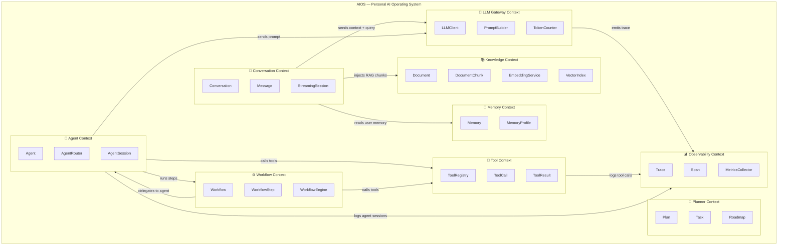

# Bounded Context — AIOS (Domain-Driven Design)

> Phân chia hệ thống AIOS thành các **Bounded Context** độc lập theo tư duy Domain-Driven Design (DDD).
> Mỗi context có ngôn ngữ riêng (Ubiquitous Language), ranh giới rõ ràng, và giao tiếp qua interface được định nghĩa.

---

## Context Map Diagram

---

## Định nghĩa từng Bounded Context

### 1. Conversation Context

**Mục tiêu:** Quản lý vòng đời của một cuộc hội thoại giữa người dùng và AI.

| Khái niệm | Ý nghĩa trong context này |
|---|---|
| `Conversation` | Phiên làm việc gồm nhiều lượt hỏi-đáp |
| `Message` | Một lượt trao đổi (user / assistant / tool) |
| `StreamingSession` | Phiên phát nội dung theo dạng streaming |

**Giao tiếp ra ngoài:**
- Gửi request → **LLM Gateway Context**
- Truy vấn tài liệu → **Knowledge Context**
- Đọc memory người dùng → **Memory Context**

---

### 2. Knowledge Context

**Mục tiêu:** Quản lý tài liệu, embedding, và tra cứu ngữ nghĩa (RAG).

| Khái niệm | Ý nghĩa trong context này |
|---|---|
| `Document` | File gốc người dùng upload |
| `DocumentChunk` | Đoạn nhỏ của Document được index |
| `EmbeddingService` | Dịch vụ tạo vector embedding |
| `VectorIndex` | Kho lưu trữ vector (Qdrant / pgvector) |

**Giao tiếp ra ngoài:**
- Trả về chunks → **Conversation Context** (qua RAG)

---

### 3. Memory Context

**Mục tiêu:** Lưu trữ và quản lý ký ức dài hạn của người dùng.

| Khái niệm | Ý nghĩa trong context này |
|---|---|
| `Memory` | Một đơn vị thông tin được lưu (key-value + category) |
| `MemoryProfile` | Tổng hợp hồ sơ người dùng từ các Memory |

**Giao tiếp ra ngoài:**
- Cung cấp context → **Conversation Context**

---

### 4. Planner Context

**Mục tiêu:** Quản lý kế hoạch, roadmap và danh sách công việc.

| Khái niệm | Ý nghĩa trong context này |
|---|---|
| `Plan` | Kế hoạch tổng thể (project / learning path) |
| `Task` | Việc cụ thể cần làm trong một `Plan` |
| `Roadmap` | Tập hợp nhiều Plan theo thứ tự |

> Planner Context chủ yếu hoạt động độc lập; dữ liệu được AI đọc/ghi qua Tool.

---

### 5. Tool Context

**Mục tiêu:** Đăng ký và thực thi các công cụ mà AI có thể gọi.

| Khái niệm | Ý nghĩa trong context này |
|---|---|
| `ToolRegistry` | Danh sách tool được đăng ký trong hệ thống |
| `ToolCall` | Một lần AI gọi tool (input + output) |
| `ToolResult` | Kết quả trả về từ tool |

**Giao tiếp ra ngoài:**
- Đăng ký tool schema → **LLM Gateway Context**
- Nhận yêu cầu gọi tool từ → **Agent Context** / **Workflow Context**

---

### 6. Workflow Context

**Mục tiêu:** Điều phối và thực thi các workflow nhiều bước.

| Khái niệm | Ý nghĩa trong context này |
|---|---|
| `Workflow` | Quy trình gồm nhiều bước kết hợp tools và agents |
| `WorkflowStep` | Một bước trong workflow (có thể là tool call hoặc agent task) |
| `WorkflowEngine` | Bộ máy điều phối trình tự các step |

---

### 7. Agent Context

**Mục tiêu:** Quản lý các agent chuyên biệt và định tuyến nhiệm vụ.

| Khái niệm | Ý nghĩa trong context này |
|---|---|
| `Agent` | Một AI agent với vai trò và bộ tool riêng |
| `AgentRouter` | Bộ phận quyết định chọn agent nào xử lý task |
| `AgentSession` | Phiên làm việc của agent (có trạng thái) |

**Chuyên biệt hóa:**
- `ResearchAgent` — tra cứu, tổng hợp thông tin
- `CodingAgent` — viết và review code
- `LearningAgent` — hỗ trợ học tập
- `ReviewAgent` — đánh giá kết quả

---

### 8. LLM Gateway Context

**Mục tiêu:** Trừu tượng hóa việc gọi LLM (OpenAI, Anthropic, local models...).

| Khái niệm | Ý nghĩa trong context này |
|---|---|
| `LLMClient` | Interface gọi LLM, ẩn provider cụ thể |
| `PromptBuilder` | Xây dựng prompt từ message history + context |
| `TokenCounter` | Đếm token, kiểm soát context window |

---

### 9. Observability Context

**Mục tiêu:** Ghi lại toàn bộ hoạt động hệ thống để debug và phân tích.

| Khái niệm | Ý nghĩa trong context này |
|---|---|
| `Trace` | Một luồng xử lý từ đầu đến cuối |
| `Span` | Một bước nhỏ trong `Trace` |
| `MetricsCollector` | Thu thập latency, token usage, error rate |

---

## Tổng hợp Context Relations

| From Context | To Context | Loại quan hệ |
|---|---|---|
| Conversation | LLM Gateway | **Upstream → Downstream** (U/D) |
| Conversation | Knowledge | **Customer / Supplier** |
| Conversation | Memory | **Customer / Supplier** |
| Agent | Tool | **Customer / Supplier** |
| Agent | Workflow | **Customer / Supplier** |
| Agent | LLM Gateway | **Upstream → Downstream** |
| Workflow | Tool | **Customer / Supplier** |
| Workflow | Agent | **Customer / Supplier** |
| LLM Gateway | Observability | **Published Language** |
| Tool | Observability | **Published Language** |
| Agent | Observability | **Published Language** |

> **Anti-Corruption Layer (ACL):** LLM Gateway Context đóng vai trò ACL giữa các context nội bộ và LLM provider bên ngoài.
