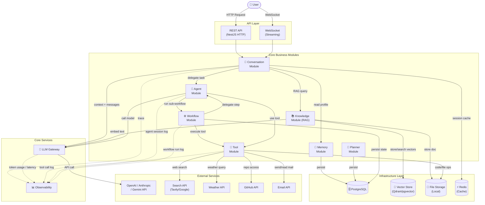
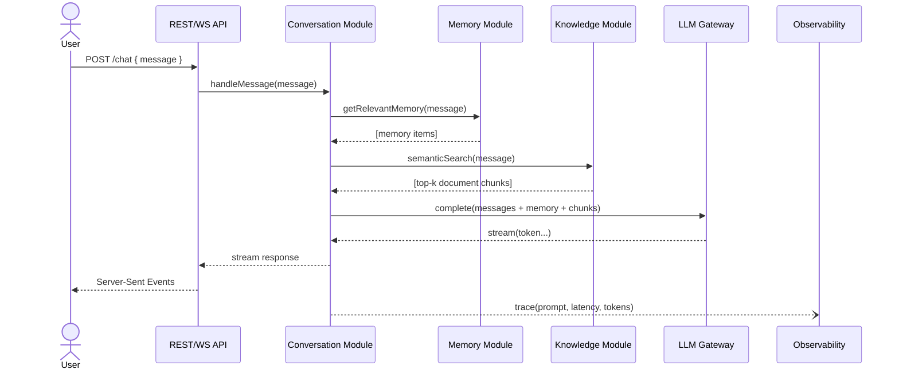
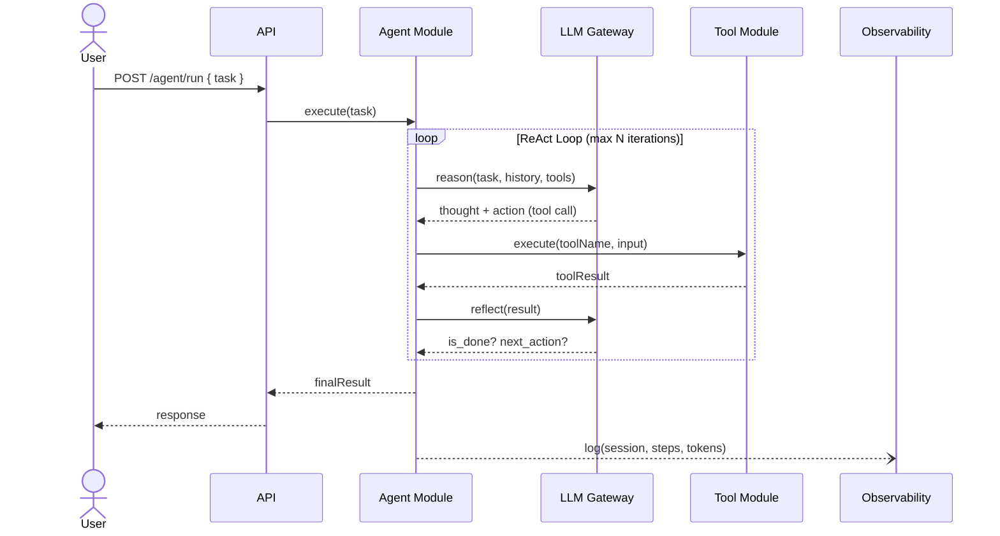
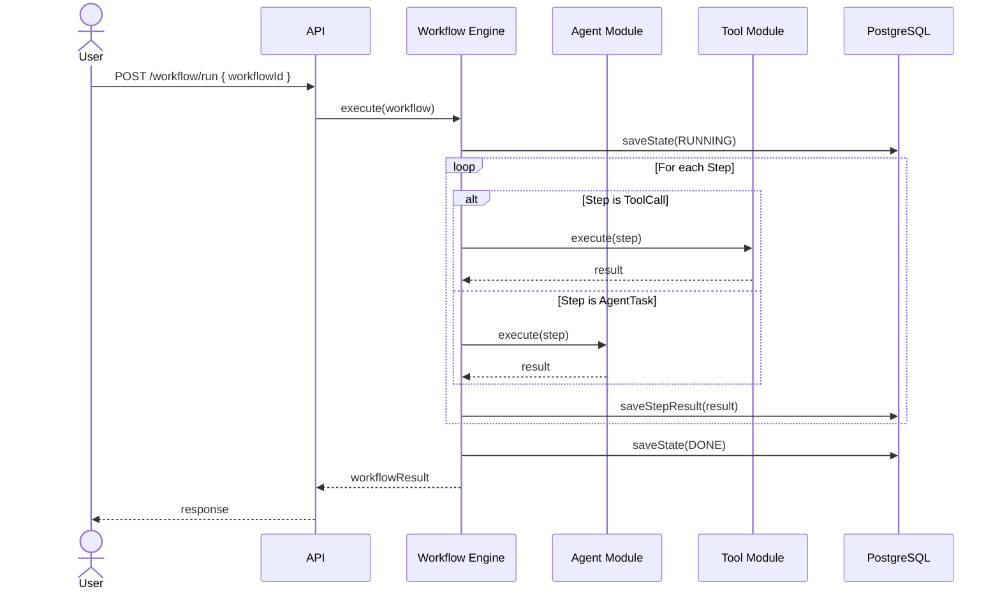
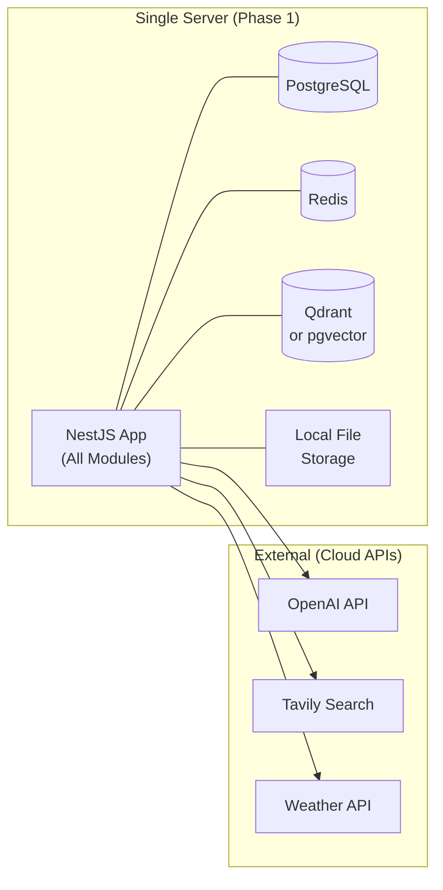

# Component Diagram — AIOS

> Mô tả cách các module giao tiếp với nhau trong hệ thống AIOS, bao gồm luồng dữ liệu, interface, và tích hợp với hạ tầng.

---

## High-Level Component Diagram



---

## Sequence Diagram — Chat với RAG



---

## Sequence Diagram — Agent thực hiện Task



---

## Sequence Diagram — Workflow Execution



---

## Interface Contract giữa các Module

### Conversation → LLM Gateway

```typescript
interface LLMRequest {
  model: string;
  messages: Array<{ role: 'user' | 'assistant' | 'tool'; content: string }>;
  tools?: ToolSchema[];
  stream: boolean;
  temperature?: number;
}

interface LLMResponse {
  content: string;
  toolCalls?: ToolCall[];
  usage: { promptTokens: number; completionTokens: number };
  finishReason: 'stop' | 'tool_calls' | 'length';
}
```

### Agent → Tool Module

```typescript
interface ToolExecutionRequest {
  toolName: string;
  input: Record<string, unknown>;
  callerAgentId?: string;
}

interface ToolExecutionResult {
  success: boolean;
  output: unknown;
  error?: string;
  latencyMs: number;
}
```

### Workflow → WorkflowStep

```typescript
interface WorkflowStep {
  id: string;
  name: string;
  type: 'tool' | 'agent' | 'condition' | 'parallel';
  config: Record<string, unknown>;
  dependsOn?: string[];  // step IDs
}

interface StepResult {
  stepId: string;
  status: 'success' | 'failed' | 'skipped';
  output: unknown;
  duration: number;
}
```

---

## Deployment View



> **Phase 1:** Monolith trên một server duy nhất.
> **Phase 2+:** Có thể tách `Knowledge`, `Workflow`, `Agent` thành microservice khi cần scale.
