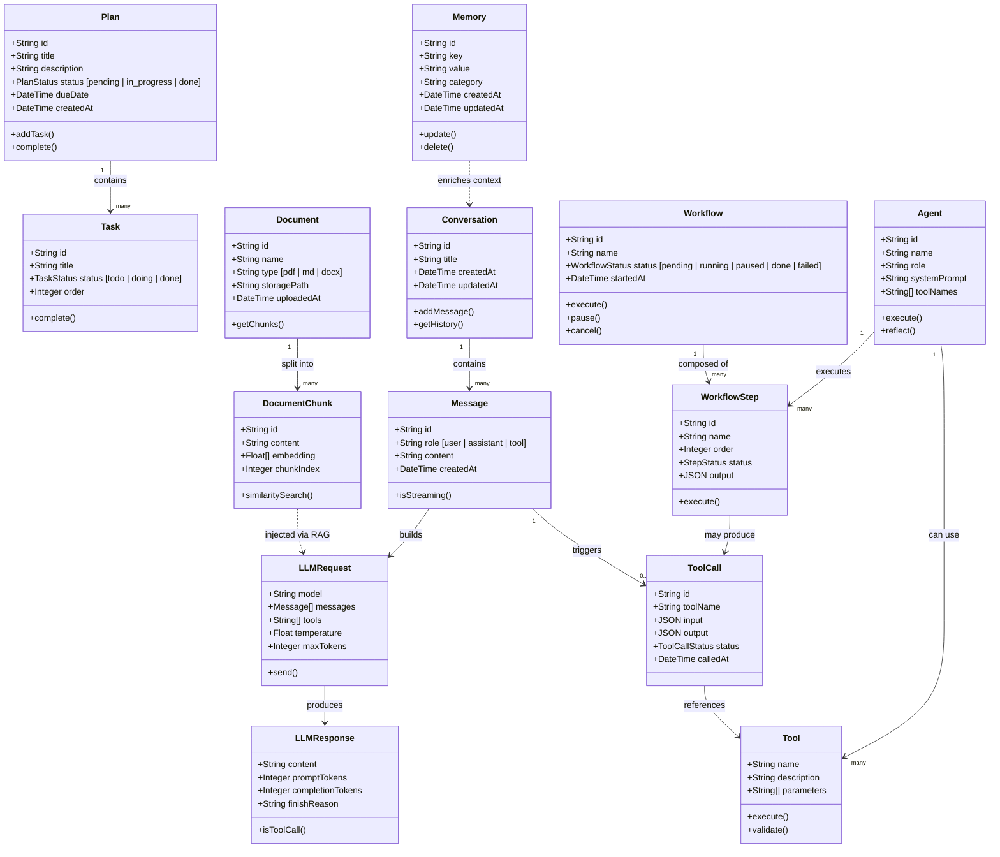

# Domain Model — AIOS

> Mô tả các thực thể cốt lõi (Entities) và quan hệ giữa chúng trong hệ thống AIOS.

---

## Domain Model Diagram

---

## Mô tả Entity

### Core Entities

| Entity | Vai trò |
|---|---|
| `Conversation` | Một phiên hội thoại, bao gồm nhiều `Message` |
| `Message` | Một tin nhắn trong cuộc hội thoại (user / assistant / tool) |
| `Document` | Tài liệu người dùng upload (PDF, MD, DOCX) |
| `DocumentChunk` | Đoạn nhỏ của `Document` được embed thành vector |
| `Memory` | Thông tin dài hạn được lưu lại về người dùng / dự án |
| `Plan` | Kế hoạch công việc gồm nhiều `Task` |
| `Task` | Đơn vị công việc nhỏ trong một `Plan` |
| `Tool` | Công cụ AI có thể gọi (Search, Weather, Calculator...) |
| `ToolCall` | Log của một lần AI gọi `Tool` |
| `Workflow` | Quy trình nhiều bước liên tiếp |
| `WorkflowStep` | Một bước trong `Workflow` |
| `Agent` | Agent chuyên biệt, có system prompt và bộ tool riêng |
| `LLMRequest` | Request gửi lên LLM |
| `LLMResponse` | Response nhận về từ LLM |

---

## Value Objects

| Value Object | Thuộc về | Mô tả |
|---|---|---|
| `embedding: Float[]` | `DocumentChunk` | Vector biểu diễn ngữ nghĩa |
| `role: enum` | `Message` | `user`, `assistant`, `tool` |
| `status: enum` | `Plan`, `Task`, `Workflow`, `WorkflowStep` | Trạng thái tiến độ |

---

## Data Storage Mapping

| Entity | Storage |
|---|---|
| Conversation, Message | PostgreSQL |
| Document (metadata) | PostgreSQL |
| Document (file) | Local Filesystem |
| DocumentChunk + Embedding | Vector Database (Qdrant / pgvector) |
| Memory | PostgreSQL |
| Plan, Task | PostgreSQL |
| ToolCall (log) | PostgreSQL |
| Workflow, WorkflowStep | PostgreSQL |
| Agent definition | PostgreSQL / Config file |
| LLMRequest / Response | Runtime only (log to Observability) |
