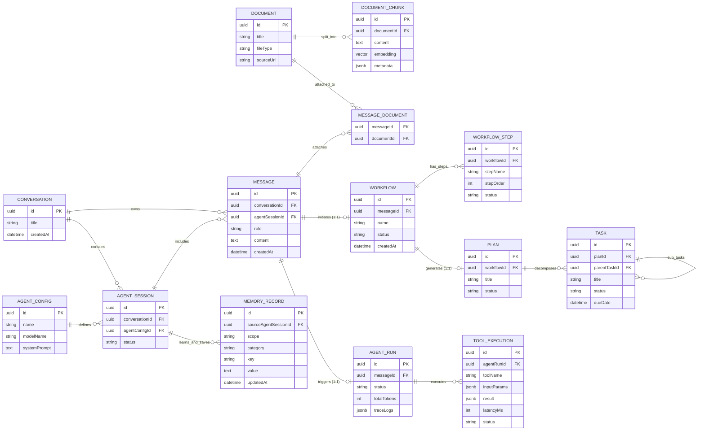

# 🏛️ AIOS — Master Entity-Relationship Diagram (ERD)

> **Kiến trúc:** Modular Monolith | Message-Centric Design | Single-Agent Architecture  
> **Cơ sở dữ liệu:** PostgreSQL 16 (`pgvector` & `uuid-ossp`)  
> **ORM:** Prisma v6  
> **Quy mô:** 14 bảng dữ liệu phân rã trên 7 Business Modules (Bounded Contexts)

---

## 1. Triết lý Thiết kế Cốt lõi (Architectural Principles)

1. **Lấy `Message` làm trung tâm điều phối (Message-Centric Design):**
   * Toàn bộ các hành động tự trị của AI (Suy luận ReAct, Khởi tạo Workflow, Gọi Tool ngoại vi) đều bắt nguồn và có thể truy vết ngược (Full Traceability) về đúng 1 tin nhắn cụ thể của người dùng.
2. **Tách bạch 3 tầng Agent (Config → Session → Run):**
   * `agent_configs`: **Ai?** (Danh tính, System Prompt, Model LLM).
   * `agent_sessions`: **Khi nào?** (Phiên làm việc dài hạn chứa nhiều tin nhắn trao đổi).
   * `agent_runs`: **Làm gì?** (Vòng lặp ReAct `Reason → Act → Reflect` xử lý cho chính xác 1 Message).
3. **Truy vết nguồn gốc ký ức (Memory Traceability):**
   * `memory_records` mang tính Global (nhớ xuyên suốt các cuộc hội thoại), nhưng có liên kết mềm `sourceAgentSessionId` (Nullable) để trả lời câu hỏi: *"AI đã học được sở thích/thông tin này từ phiên làm việc nào?"*.
4. **Knowledge RAG đa chiều (M:N Attachment):**
   * Bảng trung gian `message_documents` giải quyết bài toán: 1 tài liệu có thể được đính kèm ở nhiều tin nhắn khác nhau, và 1 tin nhắn có thể đính kèm nhiều tài liệu cùng lúc.
   * `document_chunks` tích hợp sẵn kiểu dữ liệu vector (`vector(768)`) của `pgvector`.
5. **Quy trình phân rã một chiều (Unidirectional Pipeline):**
   * `Message` $\xrightarrow{1:1}$ `Workflow` $\xrightarrow{1:N}$ `WorkflowStep`
   * `Workflow` $\xrightarrow{1:1}$ `Plan` $\xrightarrow{1:N}$ `Task` $\xrightarrow{1:N}$ `Task (Sub-tasks)`

---

## 2. Sơ đồ Thực thể Quan hệ (Master Mermaid ERD)

---

## 3. Từ điển Dữ liệu Chi tiết (Data Dictionary by Module)

### 3.1. Chat Module
| Bảng | Cột | Kiểu dữ liệu | Ràng buộc | Mô tả |
|---|---|---|---|---|
| **`conversations`** | `id` | `UUID` | PK, Default `uuid_generate_v4()` | Định danh cuộc hội thoại |
| | `title` | `VARCHAR` | Nullable | Tiêu đề cuộc hội thoại (sinh tự động bởi AI) |
| | `createdAt` / `updatedAt` | `TIMESTAMP` | Default `now()` | Thời gian tạo và cập nhật |
| **`messages`** | `id` | `UUID` | PK, Default `uuid_generate_v4()` | Định danh tin nhắn (Entity trung tâm) |
| | `conversationId` | `UUID` | FK $\rightarrow$ `conversations.id`, CASCADE | Thuộc về cuộc hội thoại nào |
| | `agentSessionId` | `UUID` | FK $\rightarrow$ `agent_sessions.id`, SET NULL | Thuộc phiên làm việc nào (Nullable, validate ở App layer) |
| | `role` | `VARCHAR` | `user` \| `assistant` \| `tool` \| `system` | Vai trò của người gửi tin nhắn |
| | `content` | `TEXT` | NOT NULL | Nội dung tin nhắn |
| | `createdAt` | `TIMESTAMP` | Default `now()` | Thời gian tạo tin nhắn |

### 3.2. Agents Module
| Bảng | Cột | Kiểu dữ liệu | Ràng buộc | Mô tả |
|---|---|---|---|---|
| **`agent_configs`** | `id` | `UUID` | PK, Default `uuid_generate_v4()` | Định danh cấu hình Agent |
| | `name` | `VARCHAR` | NOT NULL | Tên hiển thị (vd: *AIOS Chief of Staff*, *Coder*) |
| | `modelName` | `VARCHAR` | NOT NULL | Định danh model (vd: *gpt-4o*, *gemini-2.5-pro*) |
| | `systemPrompt` | `TEXT` | NOT NULL | Prompt định hình tính cách và quy tắc của Agent |
| | `createdAt` | `TIMESTAMP` | Default `now()` | Thời gian tạo |
| **`agent_sessions`** | `id` | `UUID` | PK, Default `uuid_generate_v4()` | Định danh phiên làm việc dài hạn |
| | `conversationId` | `UUID` | FK $\rightarrow$ `conversations.id`, CASCADE | Thuộc cuộc hội thoại nào |
| | `agentConfigId` | `UUID` | FK $\rightarrow$ `agent_configs.id`, RESTRICT | Sử dụng cấu hình Agent nào |
| | `status` | `VARCHAR` | `active` \| `closed` | Trạng thái phiên làm việc |
| | `createdAt` | `TIMESTAMP` | Default `now()` | Thời gian mở phiên |
| **`agent_runs`** | `id` | `UUID` | PK, Default `uuid_generate_v4()` | Định danh lượt chạy ReAct |
| | `messageId` | `UUID` | UNIQUE, FK $\rightarrow$ `messages.id`, CASCADE | Lượt chạy được kích hoạt bởi Message nào (1:1) |
| | `status` | `VARCHAR` | `running` \| `tool_calling` \| `completed` | Trạng thái vòng lặp suy luận |
| | `totalTokens` | `INTEGER` | Default `0` | Tổng token tiêu thụ trong lượt chạy |
| | `traceLogs` | `JSONB` | Nullable | Lịch sử suy luận: `Thought → Action → Observation` |
| | `createdAt` | `TIMESTAMP` | Default `now()` | Thời gian chạy |

### 3.3. Knowledge Module (RAG)
| Bảng | Cột | Kiểu dữ liệu | Ràng buộc | Mô tả |
|---|---|---|---|---|
| **`documents`** | `id` | `UUID` | PK, Default `uuid_generate_v4()` | Định danh tài liệu gốc |
| | `title` | `VARCHAR` | NOT NULL | Tên file hoặc tiêu đề tài liệu |
| | `fileType` | `VARCHAR` | Nullable | Định dạng file (`pdf`, `md`, `docx`,...) |
| | `sourceUrl` | `VARCHAR` | Nullable | Đường dẫn lưu file trên Local Storage |
| | `status` | `VARCHAR` | `pending` \| `processing` \| `indexed` \| `failed` | Tiến trình nạp RAG của tài liệu |
| | `createdAt` | `TIMESTAMP` | Default `now()` | Thời điểm upload |
| **`message_documents`** | `messageId` | `UUID` | PK, FK $\rightarrow$ `messages.id`, CASCADE | Tin nhắn đính kèm file |
| | `documentId` | `UUID` | PK, FK $\rightarrow$ `documents.id`, CASCADE | Tài liệu được đính kèm |
| **`document_chunks`** | `id` | `UUID` | PK, Default `uuid_generate_v4()` | Định danh đoạn văn bản băm nhỏ |
| | `documentId` | `UUID` | FK $\rightarrow$ `documents.id`, CASCADE | Thuộc tài liệu gốc nào |
| | `content` | `TEXT` | NOT NULL | Nội dung text của chunk |
| | `metadata` | `JSONB` | Nullable | Thông tin vị trí: page number, heading, dòng |
| | `embedding` | `vector(768)` | Nullable | Vector embedding 768 chiều phục vụ Similarity Search |

### 3.4. Tools Module
| Bảng | Cột | Kiểu dữ liệu | Ràng buộc | Mô tả |
|---|---|---|---|---|
| **`tool_executions`** | `id` | `UUID` | PK, Default `uuid_generate_v4()` | Định danh lần thực thi công cụ |
| | `agentRunId` | `UUID` | FK $\rightarrow$ `agent_runs.id`, CASCADE | Lượt chạy Agent nào đã gọi công cụ này |
| | `toolName` | `VARCHAR` | NOT NULL | Tên công cụ (vd: `web_search`, `read_file`) |
| | `inputParams` | `JSONB` | Nullable | Tham số đầu vào truyền cho tool |
| | `result` | `JSONB` | Nullable | Kết quả đầu ra trả về từ tool |
| | `latencyMs` | `INTEGER` | Nullable | Thời gian thực thi (mili-giây) |
| | `status` | `VARCHAR` | `success` \| `error` | Trạng thái thực thi |
| | `createdAt` | `TIMESTAMP` | Default `now()` | Thời điểm chạy |

### 3.5. Workflow Module
| Bảng | Cột | Kiểu dữ liệu | Ràng buộc | Mô tả |
|---|---|---|---|---|
| **`workflows`** | `id` | `UUID` | PK, Default `uuid_generate_v4()` | Định danh quy trình tự động |
| | `messageId` | `UUID` | UNIQUE, FK $\rightarrow$ `messages.id`, CASCADE | Tin nhắn khởi tạo quy trình này (1:1) |
| | `name` | `VARCHAR` | NOT NULL | Tên quy trình |
| | `status` | `VARCHAR` | `running` \| `paused` \| `completed` \| `failed` | Trạng thái State Machine |
| | `createdAt` | `TIMESTAMP` | Default `now()` | Thời điểm tạo |
| **`workflow_steps`** | `id` | `UUID` | PK, Default `uuid_generate_v4()` | Định danh bước thực hiện |
| | `workflowId` | `UUID` | FK $\rightarrow$ `workflows.id`, CASCADE | Thuộc quy trình nào |
| | `stepName` | `VARCHAR` | NOT NULL | Tên bước (vd: *Extract Requirements*, *Draft Code*) |
| | `stepOrder` | `INTEGER` | NOT NULL | Thứ tự thực hiện trong DAG |
| | `status` | `VARCHAR` | `pending` \| `running` \| `done` \| `skipped` \| `failed` | Trạng thái bước |
| | `stepOutput` | `JSONB` | Nullable | Dữ liệu kết quả của bước chuyển tiếp sang bước sau |
| | `executedAt` | `TIMESTAMP` | Nullable | Thời điểm hoàn tất bước |

### 3.6. Planner Module
| Bảng | Cột | Kiểu dữ liệu | Ràng buộc | Mô tả |
|---|---|---|---|---|
| **`plans`** | `id` | `UUID` | PK, Default `uuid_generate_v4()` | Định danh kế hoạch tổng thể |
| | `workflowId` | `UUID` | UNIQUE, FK $\rightarrow$ `workflows.id`, CASCADE | Kế hoạch sinh ra từ quy trình nào (1:1) |
| | `title` | `VARCHAR` | NOT NULL | Tiêu đề kế hoạch |
| | `status` | `VARCHAR` | `active` \| `completed` | Trạng thái kế hoạch |
| | `createdAt` | `TIMESTAMP` | Default `now()` | Thời điểm lập kế hoạch |
| **`tasks`** | `id` | `UUID` | PK, Default `uuid_generate_v4()` | Định danh nhiệm vụ cụ thể |
| | `planId` | `UUID` | FK $\rightarrow$ `plans.id`, CASCADE | Thuộc kế hoạch nào |
| | `parentTaskId` | `UUID` | Nullable, FK $\rightarrow$ `tasks.id`, CASCADE | Nhiệm vụ cha (Hỗ trợ cấu trúc cây Sub-tasks) |
| | `title` | `VARCHAR` | NOT NULL | Tiêu đề nhiệm vụ |
| | `status` | `VARCHAR` | `todo` \| `in_progress` \| `done` | Tiến độ nhiệm vụ |
| | `dueDate` | `TIMESTAMP` | Nullable | Hạn chót hoàn thành |
| | `createdAt` | `TIMESTAMP` | Default `now()` | Thời điểm tạo |

### 3.7. Memory Module
| Bảng | Cột | Kiểu dữ liệu | Ràng buộc | Mô tả |
|---|---|---|---|---|
| **`memory_records`** | `id` | `UUID` | PK, Default `uuid_generate_v4()` | Định danh ký ức dài hạn |
| | `sourceAgentSessionId` | `UUID` | Nullable, FK $\rightarrow$ `agent_sessions.id`, SET NULL | Phiên làm việc đã học ký ức này (Traceability) |
| | `scope` | `VARCHAR` | `global` \| `conversation` | Phạm vi ảnh hưởng của ký ức |
| | `category` | `VARCHAR` | `profile` \| `preference` \| `fact` | Phân loại ký ức |
| | `key` | `VARCHAR` | UNIQUE, NOT NULL | Khóa truy xuất nhanh (vd: `preferred_language`) |
| | `value` | `TEXT` | NOT NULL | Nội dung chi tiết của ký ức |
| | `updatedAt` | `TIMESTAMP` | Auto update | Thời điểm cập nhật gần nhất |

---

## 4. Quy ước Toàn vẹn Dữ liệu (Integrity & Cascade Rules)

* **Xóa Conversation:** Khi xóa 1 `conversation`, toàn bộ `messages`, `agent_sessions`, `workflows`, `plans`, `tasks` liên quan sẽ bị xóa theo dây chuyền (`onDelete: Cascade`).
* **Xóa Session và Ký ức:** Khi 1 `agent_session` bị xóa, các `memory_records` được học từ session đó **không bị xóa mất**, mà trường `sourceAgentSessionId` tự động chuyển về `NULL` (`onDelete: SetNull`) nhằm bảo toàn ký ức dài hạn của người dùng.
* **Dual Foreign Key trên Message:** Bảng `messages` mang 2 khóa ngoại `conversationId` và `agentSessionId`. Tính toàn vẹn logic (Message phải thuộc về Session nằm trong đúng Conversation đó) được **kiểm soát và xác thực ở tầng Application Service** (NestJS Guard / Service) để đảm bảo linh hoạt cho các tin nhắn mở đầu chưa kịp gắn Session.

