# Use Case Diagram — AIOS

> Mô tả những hành động mà người dùng có thể thực hiện trong hệ thống AIOS.

---

## Actor

**Primary Actor:** `User` (Single developer / owner của hệ thống)

---

## Use Case Diagram

```mermaid
flowchart TD
    User(["👤 User"])

    subgraph AIOS ["🖥️ AIOS System"]

        subgraph Chat ["💬 Chat Module"]
            UC1["Send Message"]
            UC2["Receive Streaming Response"]
            UC3["View Conversation History"]
        end

        subgraph Knowledge ["📚 Knowledge Module"]
            UC4["Upload Document\n(PDF / MD / DOCX)"]
            UC5["Delete Document"]
            UC6["Search Document"]
            UC7["Ask Question on Document (RAG)"]
        end

        subgraph Memory ["🧠 Memory Module"]
            UC8["Save Memory"]
            UC9["Update Memory"]
            UC10["Delete Memory"]
            UC11["View Stored Memories"]
        end

        subgraph Planner ["📅 Planner Module"]
            UC12["Create Plan"]
            UC13["Update Plan"]
            UC14["Complete Plan"]
            UC15["View Plans"]
        end

        subgraph Tools ["🔧 Tool Module"]
            UC16["Use Search Tool"]
            UC17["Use Weather Tool"]
            UC18["Use Calculator Tool"]
            UC19["Use Filesystem Tool"]
        end

        subgraph Workflow ["⚙️ Workflow Module"]
            UC20["Execute Workflow"]
            UC21["Resume Workflow"]
            UC22["Cancel Workflow"]
        end

        subgraph Agent ["🤖 Agent Module"]
            UC23["Create Agent"]
            UC24["Execute Agent"]
            UC25["Route to Specialized Agent"]
        end

    end

    User --> UC1
    User --> UC3
    User --> UC4
    User --> UC5
    User --> UC6
    User --> UC7
    User --> UC8
    User --> UC9
    User --> UC10
    User --> UC11
    User --> UC12
    User --> UC13
    User --> UC14
    User --> UC15
    User --> UC20
    User --> UC21
    User --> UC22
    User --> UC23

    UC1 --> UC2
    UC7 --> UC6
    UC20 --> UC24
    UC24 --> UC25
    UC25 --> UC16
    UC25 --> UC17
    UC25 --> UC18
    UC25 --> UC19
```

---

## Mô tả Use Case theo nhóm

### Chat Module

| Use Case | Mô tả |
|---|---|
| Send Message | Người dùng gửi câu hỏi hoặc lệnh cho AI |
| Receive Streaming Response | AI trả lời theo dạng stream (token by token) |
| View Conversation History | Xem lại lịch sử cuộc hội thoại |

### Knowledge Module

| Use Case | Mô tả |
|---|---|
| Upload Document | Tải lên tài liệu PDF, Markdown, DOCX |
| Delete Document | Xoá tài liệu đã upload |
| Search Document | Tìm kiếm trong kho tài liệu |
| Ask Question on Document | Đặt câu hỏi và AI trả lời dựa trên nội dung tài liệu (RAG) |

### Memory Module

| Use Case | Mô tả |
|---|---|
| Save Memory | Lưu thông tin quan trọng vào bộ nhớ dài hạn |
| Update Memory | Cập nhật thông tin đã lưu |
| Delete Memory | Xoá ký ức không còn cần thiết |
| View Memories | Xem danh sách các ký ức được lưu |

### Planner Module

| Use Case | Mô tả |
|---|---|
| Create Plan | Tạo kế hoạch mới (task, roadmap) |
| Update Plan | Cập nhật tiến độ kế hoạch |
| Complete Plan | Đánh dấu kế hoạch hoàn thành |
| View Plans | Xem danh sách kế hoạch hiện tại |

### Tool Module

| Use Case | Mô tả |
|---|---|
| Use Search Tool | AI dùng công cụ tìm kiếm web |
| Use Weather Tool | AI truy vấn thông tin thời tiết |
| Use Calculator | AI thực hiện tính toán |
| Use Filesystem Tool | AI đọc/ghi file hệ thống |

### Workflow Module

| Use Case | Mô tả |
|---|---|
| Execute Workflow | Chạy một quy trình nhiều bước liên tiếp |
| Resume Workflow | Tiếp tục workflow bị tạm dừng |
| Cancel Workflow | Huỷ workflow đang chạy |

### Agent Module

| Use Case | Mô tả |
|---|---|
| Create Agent | Tạo agent chuyên biệt mới |
| Execute Agent | Kích hoạt một agent để thực hiện nhiệm vụ |
| Route to Agent | Hệ thống tự định tuyến đến agent phù hợp |
