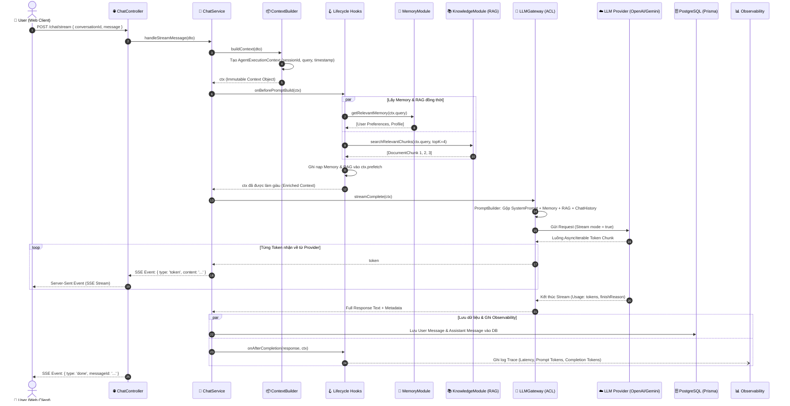
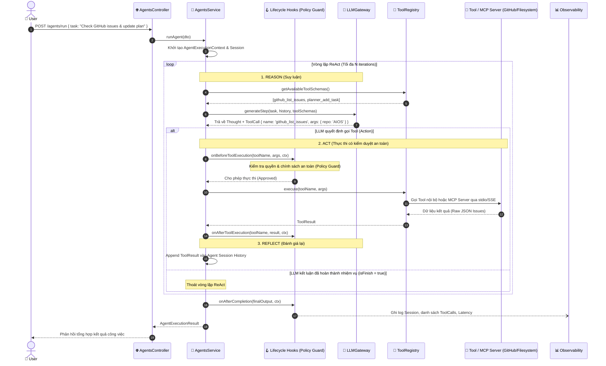
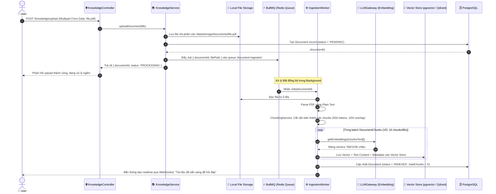

# AIOS Request Flow Specification

> **Tài liệu đặc tả chi tiết các luồng xử lý yêu cầu (Request Flow) trong hệ thống AIOS**  
> *Mô tả tường tận từ thời điểm Client gửi Request qua API Layer, đi qua các Middleware, Lifecycle Hooks, Service Orchestrator, Core Gateway đến Hạ tầng (DB, Vector Store, LLM Provider) và Streaming kết quả ngược lại.*

---

## 1. Tổng quan Các Loại Request trong AIOS

Hệ thống AIOS tiếp nhận và xử lý 5 luồng request chính:

1. **Flow 1: Conversational Chat Flow (Chat + Memory + RAG + Streaming):** Luồng trò chuyện tương tác trực tiếp với phản hồi streaming dạng token-by-token.
2. **Flow 2: Autonomous Agent Flow (ReAct Loop + Tool/MCP + Policy Guard):** Luồng thực thi nhiệm vụ phức tạp tự trị (Reason $\rightarrow$ Act $\rightarrow$ Reflect).
3. **Flow 3: Knowledge Ingestion & Indexing Flow:** Luồng upload tài liệu và xử lý trích xuất văn bản, chunking, sinh vector nhúng chạy ngầm qua Queue.
4. **Flow 4: Workflow Execution Flow (Multi-step DAG Pipeline):** Luồng điều phối các quy trình tự động hóa nhiều bước có lưu vết trạng thái để Pause/Resume.
5. **Flow 5: Background Memory Extraction Flow:** Luồng ngầm tự động phân tích hội thoại để trích xuất thói quen, sở thích của người dùng và lưu vào bộ nhớ dài hạn.

---

## 2. Flow 1: Conversational Chat Flow (Chat + RAG + Memory)

Đây là luồng phổ biến nhất khi người dùng đặt câu hỏi trực tiếp trên giao diện web và mong muốn câu trả lời phản hồi tức thì dưới dạng streaming.

### 2.1. Biểu đồ Sequence Diagram



### 2.2. Chi tiết Biến đổi Dữ liệu (Data Transformation)
1. **Request DTO (Input):**
   ```json
   {
     "conversationId": "conv_12345",
     "content": "Dự án AIOS dùng kiến trúc gì?",
     "model": "gpt-4o"
   }
   ```
2. **Context Object sau khi Enrich (`AgentExecutionContext`):**
   * `ctx.query`: `"Dự án AIOS dùng kiến trúc gì?"`
   * `ctx.context.userProfile`: `{ role: "Software Engineer", techStack: ["TypeScript", "NestJS"] }`
   * `ctx.prefetch.ragChunks`: `["docs/architecture.md: AIOS thiết kế theo Modular Monolith..."]`
3. **Payload gửi lên LLM Provider:**
   * Ghép `System Prompt` định hình vai trò Personal Chief of Staff.
   * Chèn khối context RAG: `<context>...</context>`.
   * Lịch sử 5 tin nhắn gần nhất.
   * Câu hỏi hiện tại của người dùng.
4. **SSE Event Stream (Output):**
   ```text
   event: token
   data: {"content": "Dự án "}

   event: token
   data: {"content": "AIOS được thiết kế..."}

   event: done
   data: {"messageId": "msg_987", "tokens": 420}
   ```

---

## 3. Flow 2: Autonomous Agent Flow (ReAct Loop + Tool/MCP Execution)

Luồng kích hoạt khi người dùng giao một nhiệm vụ đòi hỏi hành động và tương tác với hệ thống bên ngoài (Ví dụ: *"Kiểm tra GitHub issues của repo AIOS và lên kế hoạch làm việc hôm nay"*).

### 3.1. Biểu đồ Sequence Diagram



### 3.2. Cơ chế Policy Guard (Học hỏi từ Caremate)
Trước khi bất kỳ Tool nào được chạy qua `onBeforeToolExecution`:
* **Read-only tools (Search, Read File, Get Calendar):** Tự động duyệt chạy ngay.
* **Mutating tools (Write File, Delete File, Send Mail, Commit Code):** 
  * Nếu mức độ nguy hiểm cao: Hook tạm dừng Agent (`PAUSED_WAITING_CONFIRMATION`), bắn thông báo về Web UI yêu cầu người dùng bấm `Approve / Reject`.
  * Khi người dùng Approve: Tiếp tục thực thi tool.

---

## 4. Flow 3: Knowledge Ingestion & Indexing Flow (Document RAG)

Xử lý khi người dùng tải lên tài liệu (PDF, Markdown, DOCX) để đưa vào tri thức cá nhân của AIOS. Tác vụ được chuyển sang xử lý bất đồng bộ (Asynchronous Worker) bằng BullMQ để không làm nghẽn server.

### 4.1. Biểu đồ Sequence Diagram



---

## 5. Flow 4: Workflow Execution Flow (Multi-step DAG)

Dành cho các quy trình nhiều bước, chạy tuần tự hoặc phân nhánh (Ví dụ: *"Thu thập thông tin $\rightarrow$ Tóm tắt $\rightarrow$ Sinh Todo Task $\rightarrow$ Gửi email báo cáo"*).

### 5.1. Cơ chế State Persistence
Mỗi bước trong Workflow được điều phối bởi `WorkflowEngine`:
1. **Trước khi chạy Step:** Ghi trạng thái `StepStatus = RUNNING` vào PostgreSQL.
2. **Nếu Step là Tool:** Ủy thác trực tiếp cho `ToolModule`.
3. **Nếu Step là Sub-Agent:** Khởi tạo `AgentSession` riêng, chạy ReAct loop và chờ kết quả.
4. **Sau khi chạy Step:** Lưu kết quả `StepResult (JSON)` vào PostgreSQL và cập nhật trạng thái `StepStatus = COMPLETED`.
5. **Cơ chế Khôi phục (Resume):** Nếu server bị restart hoặc gặp sự cố giữa chừng, `WorkflowEngine` kiểm tra database, tìm step cuối cùng còn dang dở hoặc chưa chạy để tiếp tục (`Resume`) mà không phải chạy lại từ đầu.

---

## 6. Xử lý Lỗi và Chiến lược Dự phòng (Error Handling & Fallbacks)

Để đảm bảo hệ thống vận hành bền bỉ (Fault-Tolerant), AIOS áp dụng các cơ chế dự phòng ở từng tầng:

| Tình huống lỗi | Vị trí phát sinh | Cơ chế xử lý dự phòng (Fallback Strategy) |
|---|---|---|
| **LLM Provider Timeout / Rate Limit** | `core/llm` | Tự động thử lại (Retry with Exponential Backoff) tối đa 3 lần. Nếu vẫn thất bại, tự động chuyển vùng (Fallback) sang Provider phụ (VD: OpenAI $\rightarrow$ Gemini $\rightarrow$ Local Ollama). |
| **Tool Execution Thất bại** | `modules/tools` | Bắt ngoại lệ và đóng gói mã lỗi vào `ToolResult.error`. Gửi thông báo lỗi ngược lại cho LLM để AI nhận biết và tự suy luận cách khắc phục (Self-Correction). |
| **Vector DB không phản hồi** | `modules/knowledge` | Bỏ qua phần RAG context, ghi log cảnh báo và tiếp tục cho phép hội thoại thông thường với dữ liệu từ Memory và Chat History. |
| **Token Tràn Context Window** | `core/llm` | `TokenCounter` phát hiện vượt ngưỡng $\rightarrow$ Kích hoạt cơ chế cắt tỉa: Rút ngắn lịch sử chat cũ, tóm tắt ngữ cảnh (Summarization), chỉ giữ lại các RAG chunks có độ tương đồng cao nhất. |

---

## 7. Tổng kết

Nhờ việc chuẩn hóa các **Request Flow** kết hợp **Context Object** và **Lifecycle Hooks**:
* Luồng dữ liệu trong AIOS có tính **nhất quán tuyệt đối (Consistent Data Flow)**.
* Tất cả request đều để lại dấu vết đầy đủ (Full Observability Trace).
* Các module giữ được tính độc lập cao, dễ dàng bảo trì, viết unit/integration tests và sẵn sàng mở rộng.

